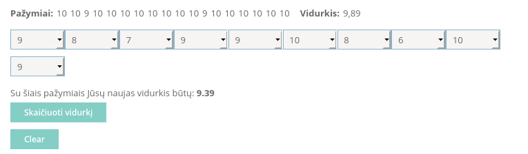
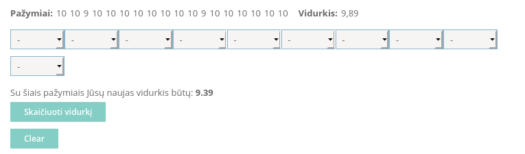

# Tamo "Vidurkių skaičiavimas" patch 
Tamo dienyne yra labai naudinga funkcija vidurkiui su galimais pažymiais apskaičiuoti. Tačiau dažnai
reikia nustatyti skaičiavimus iš naujo, or naujinti puslapį kiekvieną kartą
trunka pakankamai laiko bei padidina dienyno apkrovimą.

Šis script'as problemą nusprendžia gana paprastai: sukuria "Clear" mygtuką,
paspaudęs kurį, visi papildomi pažymiai yra ištrinti. Galima planuoti ateitį iš naujo!


## Installation

Pirmiausia, jums reikia instaliuoti
[Code Injector](https://github.com/Lor-Saba/Code-Injector).

URL pattern: `https://dienynas\.tamo\.lt/Pamoka/VidurkiuSkaiciavimas.*$`

### Script

``` javascript
var div = document.createElement('div');
div.className = 'clear borderless padL15';

var button = document.createElement('button');
button.className = 'clickable c_btn';
button.innerHTML = '<span>Clear</span>';
button.style.marginTop = '10px';

button.onclick = function() {
    for (var id = 0; id < 10; id++) {
        document.getElementById('item:' + id).selectedIndex = 0;
    }
}


div.appendChild(button);
document.getElementById('c_main').appendChild(div);
```

Nepamirškite pažymeti "On page load" mygtuką, kad veiktų automatiškai.

## Screenshots
### Prieš paspaudinant mygtuką:

### Spaudžiam... Gone!

